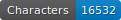
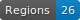
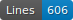
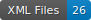

Moonshines
==========

    

## License

This dataset and model are published under the CC-BY 4.0 License.

To cite this dataset:

``` 
Chagué, A. (2023). moonshines (Version 1.0.0) [Computer software]. https://doi.org/10.5281/zenodo.1234
```

## Description

This dataset is composed of pages of text written in 2023 by a single person, copying texts taken from Guillaume Apollinaire's poems published in [*Alcools*](https://www.gutenberg.org/cache/epub/15462/pg15462.txt). 

The dataset is divided into two parts: 

- `data/` which is intended to train transcription models,
- `test/` which is intended for test.

## Transcription guidelines

The transcription strictly follows what is written on the images, including accentuation or capitalization errors.

The segmentation follows the SegmOnto ontology and mostly relies on `MainZone` and `DefaultLine`.

## Possible limitations

Since the text follows the structure of *Alcools*, there is almost no ponctuation in this ground truth. Besides, most of the lines start with a capital letter.
